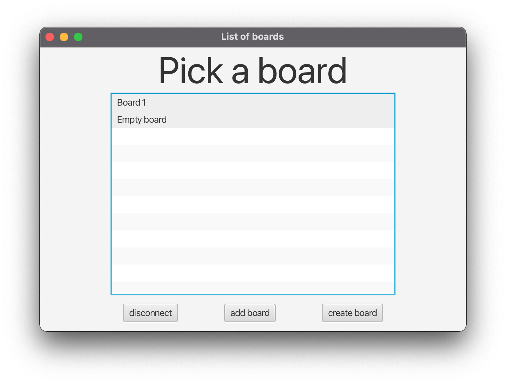
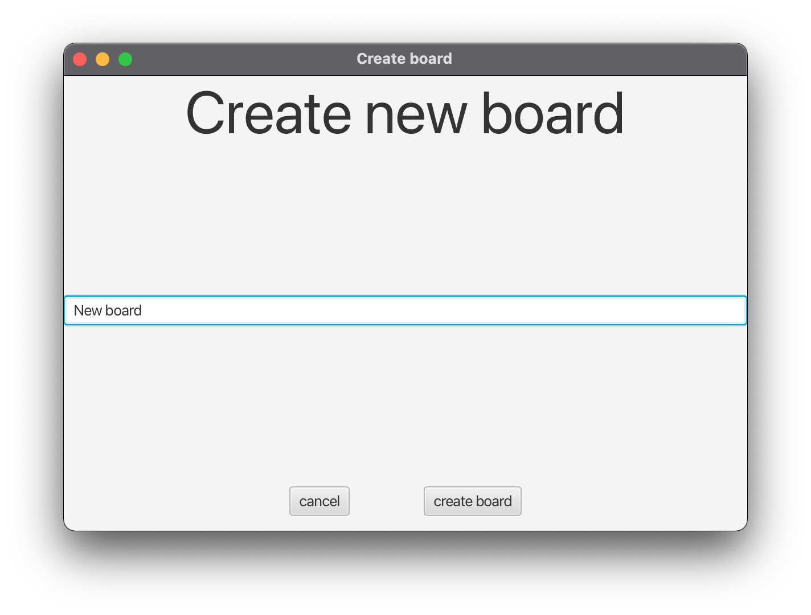
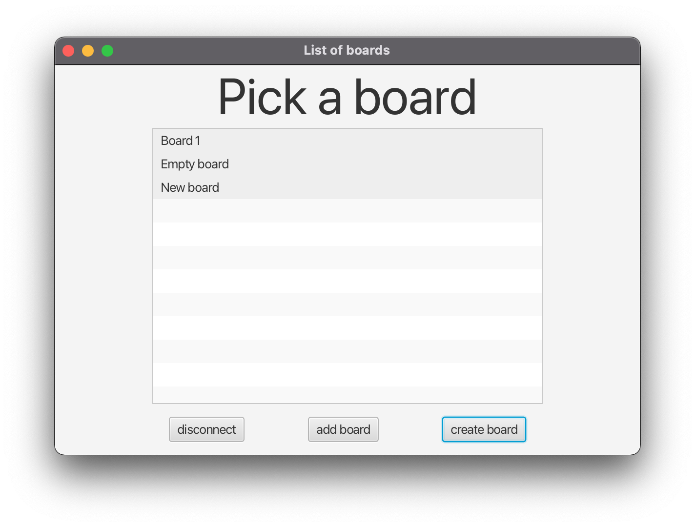
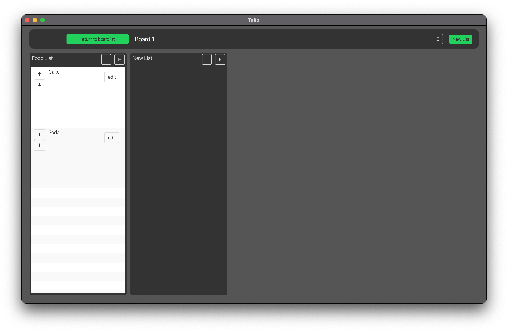
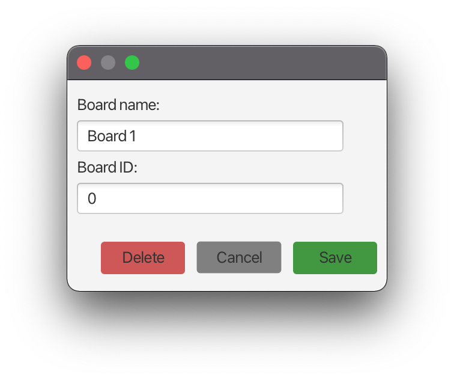
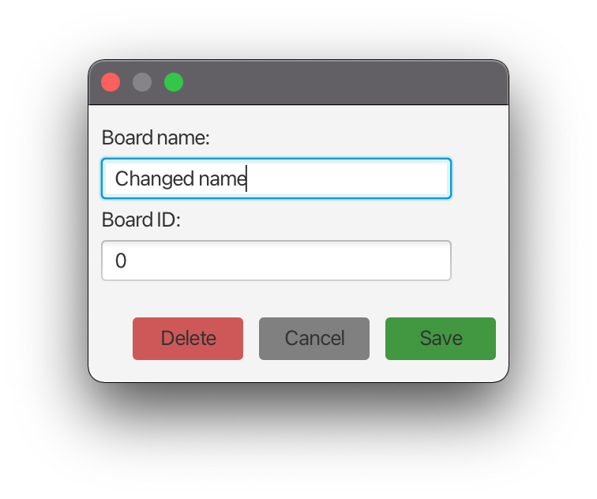
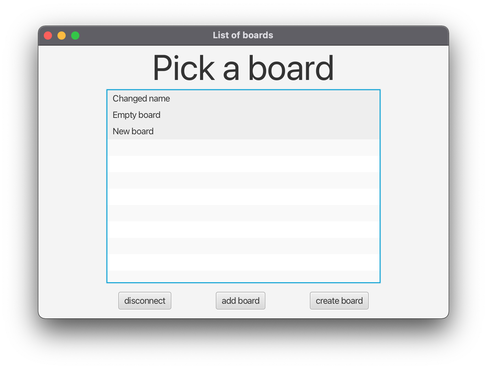
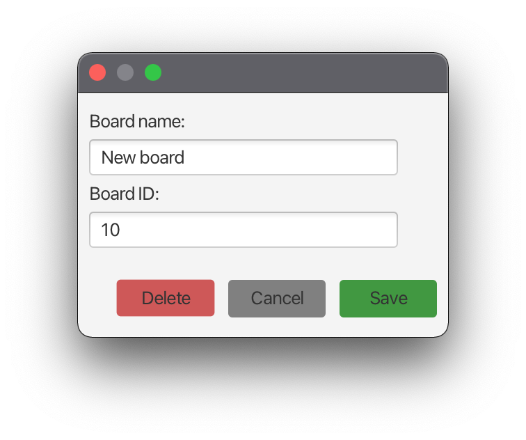
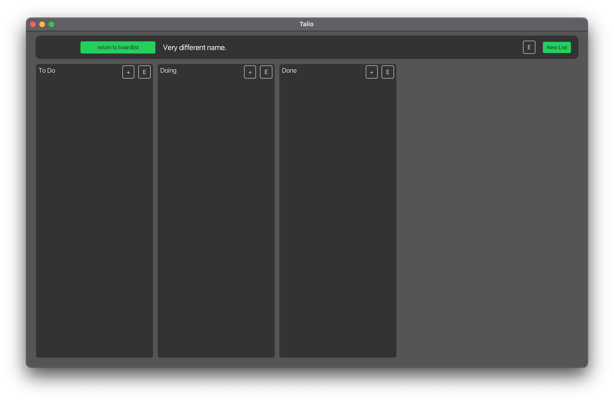

# Tests for the multi-board feature

<!-- TOC -->
* [Tests for the multi-board feature](#tests-for-the-multi-board-feature)
  * [Create boards](#create-boards)
  * [Renaming test](#renaming-test)
<!-- TOC -->

## Create boards
Go to the list of boards by connecting to the server:

click the button create new board.

Press cancel,
you should be back to the initial list of boards:

Now click create new board again.

Add a title and then press create board.
You should now see the list of boards but with new board added.

## Renaming test
Open two clients and open the same board in both

Press the edit button (button in top bar with E ) of the board overview in one client

Test that you cannot change the id.  
Change the name of the board and then press cancel.  
The name of the board should not have changed:

Nothing should have changed.
Let's edit the board details again.

It has the old board name again.
Let's modify it:

This time, we'll press save.

Verify that it has also changed in your second client.

In one of the client's go back to the list of boards.

The board name should have changed here too.

Let's open a different different from before oard and edit its name.

Let's change the name to "Very different name" and press save.
Assert that only the board name of the client with this board open has changed, and not the client that still has the other board open. 
just opened board:

Other client with the old board:

You've successfully tested renaming boards!