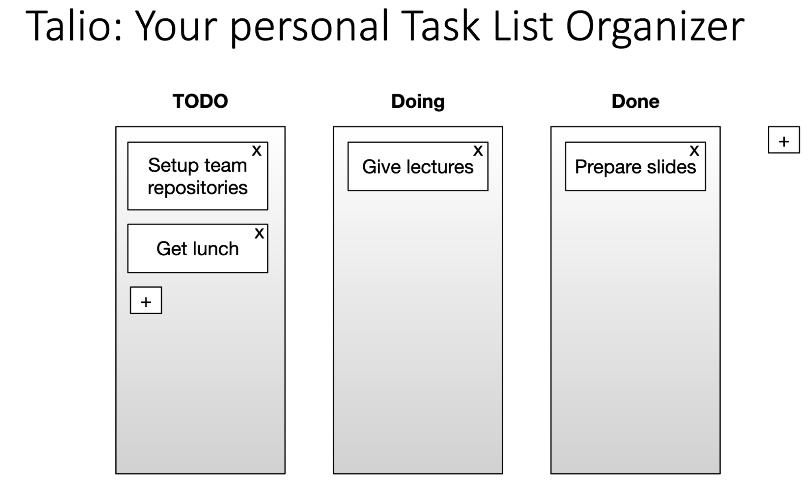
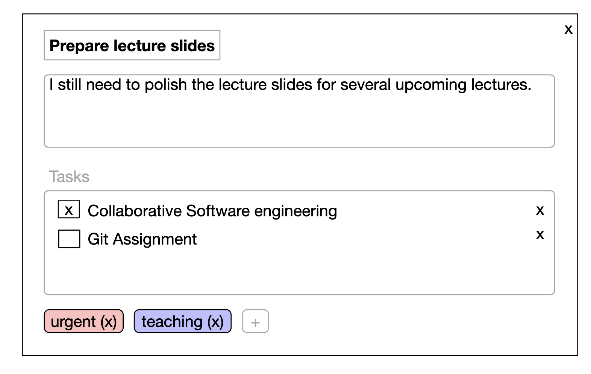

BACKLOG
=======
*Teletubbies & Co™ | Group 17 OOPP*

## Stakeholders

- **Users** - the people who use the application to manage boards.
- **Host** - the person that hosts and/or manages the server. This stakeholder has an administrative role.

## Terminology

- **Database** - store of all persistent data
- **Boards** - A set of lists
- **List** - set of the cards
- **Cards** - An item

## User Stories

### Epic 1: MVP (In order of priority)

As a **User** I want:

- to view the board (without registration), so I can see the contents of the board
  * Opening the application automatically loads the board from database
  * Loaded board is viewed in the UI
- to create/remove a list within a board, so I can create various categories for my cards (first mock)
  * Created lists appear on the board
  * Created lists are added to the database
  * Application asks for confirmation before deleting a list
  * Deleted lists do not appear on the board
  * Deleted lists removed from database
- to add/remove cards to lists, so I can add new TO DO’s when I have a new task I need to do and remove them in case
  they turn out to not be necessary (first mock)
  * Created cards appear on their list
  * Created cards are added to the database
  * Application asks for confirmation before deleting a card
  * Deleted cards do not appear on the board
  * Deleted cards removed from database
- a card to have only of a title, to keep list items simple to understand
  * When creating a card it has one mandatory text field
  * A card in the board overview shows its text content
- to move cards in a visual way (drag & drop), to help organize my lists easily
  * When card is clicked and held it can be moved around
  * When held card is dropped (release mouse button) it is put in the nearest list
  * Moved card is updated in the database
- to move cards up and down in a list, so I can prioritize my TO DO’s.
  * A list has an order
  * A card position in the list can be changed
  * Change in a card position is updated in the database
- lists on the board have a changeable order, so I can put the lists in a logical order and have the more
  commonly used lists more readily accessible.
  * Board has an order for its lists
  * Created list is added to some position in the board order
  * A list position can be changed
  * A change in the board order is updated in the database
- to see all changes in real time for every user, so you can collaborate more easily and don’t have to keep hitting a
  refresh button to see if another user has done something
  * Every change to the board automatically updates all connected clients view

### Epic 2: Multi-board

As a **User** I want:

- to create multiple boards and get those boards keys,
so I can separate tasks for different projects for better organization (e.g. separate work and private chores).
  * Created boards appear in the application overview
  * When created, a board gets its own unique key as identification
  * The board key can be shown after the board creation
- To set & change the title of a board, so I can more easily distinguish between different boards
  * Each board has a title
- to view boards using a key (and password), so I can work on multiple boards which can be for different things
This way I can also make personalized boards.
  * A board's key can be used to find the board among the other boards
  * A client with the password can edit a board, and without it only view
- to add a password to a board, so I can share what I’m doing without risking someone destroying my board
  * A password can be added to a board without one
  * Any client can add a password to a board
- to change the board's password, to keep the board protected
  * With a board's password a client can edit the board content
  * With a board's password a client can change the board's password
- to remove a password, so I can allow anyone to modify my board
  * With a board's password a client can remove the password

### Epic 3: Board details

As a **User** I want:

- to add a description, so I can elaborate on what I mean with a task 
  * In addition to its title, when creating a card it has an optional secondary text field
  * The description can be updated
  * The description is showed in a smaller font under the card title in the board overview
- add a (potentially nested) task list,
so I can split the tasks into sub-tasks to make cards seem more doable and encourage progress.
  * Sub-tasks with tick boxes can be added to a card
  * Sub-tasks can be marked and unmarked as done
  * Sub-tasks can be updated
  * Sub-tasks can be deleted
  * In the board overview, a card shows under its description how many sub-tasks this card have and how many of them marked as completed

### Epic 4: Tags

As a **User** I want:

- to create, edit and delete tags, so I can have more flexibility in describing and organizing cards
  * Tags can be created
  * Created cards can be edited
  * Created cards can be deleted
- Add and remove tags from/to cards, so I can specify the type of task it is and be able to retrieve it more easily later
  * Tags can be added to cards
  * A card can have multiple tags
  * In a board overview each card's tags are shown on the card
- Filter by tags (only cards with a certain tag will be visible), so I can more quickly find a specific card I’m looking for and/or to have a better overview of cards related to another card
  * Board has a search and filter feature
  * filtering by tags shows all cards with those tags

### Epic 5: Customization

As a **User** I want:

- to add background color to my board, to make them look nicer and/or to have a visual separation between boards
  * Boards have default color when created
  * Board's color can be changed by anyone with edit access
  * Text color change with board color (if current color makes it hard to read the text)
- Specify tag color, to be able to visually distinguish between different tags for better organization
  * Tags have default color when created
  * TAg's color can be changed by anyone with edit access
  * Text color change with tag color (if current color makes it hard to read the text)

### Epic 6: Keyboard shortcuts

As a **User** I want:

- to use keyboard shortcuts, to have a more efficient workflow
  * Cards/lists can be in 'selected mode'
  * A specific key combination for adding lists or cards to selected list exists
  * A specific key combination for deleting lists or cards from selected list exists
- to have a keyboard shortcuts cheat sheet, so I can know/remember what shortcuts are available
  * The application has a page with the keys combinations and how you use them

### Epic 7: Server management

As a **host** I want:

- to stop/restart the server, so I can fix potential glitches and/or perform updates
  * Server can be stopped while clients using the application, "kicking" all current clients out
  * All changes to the server (new items, updates to items, etc.) since it was activated are saved to the database 
- change/reset passwords of boards, so I can help people who are locked out of their own board
  * Host can change password of any board without using the current password
  * Host can set a temporary password for a board to give access to it until a new password is set by client
- delete boards, so I can comply with local laws and/or remove offensive content
  * Host can delete a board that doesn't have a password
  * Host can delete a board that have a password without needing the password

## Mocks

Attribution: this picture is from the slides

Attribution: this picture is from the slides
